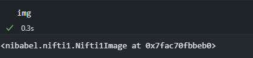

# 代码笔记

## python

### functools partial


~~~python

from functools import partial
import torch.nn as nn
# nn.LayerNorm 为其它函数
norm_layer = norm_layer or partial(nn.LayerNorm, eps=1e-6)
~~~

python 自带库

functools 模块应用于高阶函数，即参数或（和）返回值为其他函数的函数。

partial() 会被“冻结了”一部分函数参数和/或关键字的部分函数应用所使用，从而得到一个具有简化签名的新对象。 

代码实例
~~~python
>>> from functools import partial
>>> basetwo = partial(int, base=2)
>>> basetwo.__doc__ = 'Convert base 2 string to an int.'
>>> basetwo('10010')
18
~~~

### NiBabel

pip install nibabel

NeuroImaging

对于一些常见的神经影像文件格式进行读/写访问

~~~python
import os
import numpy as np
# nibabel 自带的一个图片
from nibabel.testing import data_path
example_file = os.path.join(data_path, 'example4d.nii.gz')


import nibabel as nib
img = nib.load(example_file)
~~~




### pydicom

`pip install pydicom`

一个专门用来处理 DICOM 文件的包，可以处理医学图像（CT）

~~~python
from pydicom import dcmread

ds = dcmread(file)

~~~


### SimpleITK

```bash
conda install -c simpleitk simpleitk
```

处理医学图像的库
