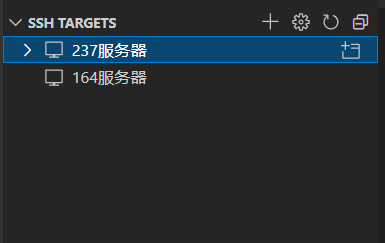
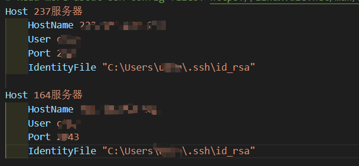

# 服务器杂记

## 安装jdk

yum search java | grep jdk

yum install 其中一个

## scp 命令传递文件

scp 源 root@ip:路径

~~~bash
# -r 文件夹
# -P 对方的端口
scp -P 2023 -r "/home/cike/projects/python_utils/" cike@222.201.134.237:/home/cike/projects

scp -P 2023 "/home/cike/projects/ActionCLIP/exp/clip_ucf/ViT-B/16/ucf101/20220426_092526/model_best.pt" cike@222.201.134.237:/home/cike/
~~~

nohup scp -P 2023 -r "/home/cike/datasets/k400/rawframes_train/" cike@222.201.134.237:/home/cike/datasets/k400_val_raw &

## 安装 anaconda

```bash
wget https://repo.anaconda.com/archive/Anaconda3-2021.11-Linux-x86_64.sh
bash Anaconda3-2021.11-Linux-x86_64.sh
vi ~/.bashrc #编辑环境变量
# 添加 export PATH="/home/Sweeneys/anaconda3/bin:$PATH"
source ~/.bashrc #刷新环境变量
```

## 使用 vscode 连接服务器

```bash
ssh-keygen #生成密钥
```

我之前用腾讯的服务器，已经生成过一次了，一对密钥可以给多个服务器使用。

密钥对的文件名称为 id_rsa 和 id_rsa.pub，应该分别是私钥和公钥

将 公钥 id_rsa.pub 放到服务器中的 ~/.ssh 文件夹中，然后

```bash
cat id_rsa.pub >> authorized_keys
```

即可。



点击齿轮，选择配置文件，可以将配置文件放在 D盘中，然后编辑配置文件即可。



## wandb未登录？

成功解决：wandb.errors.UsageError: api_key not configured (no-tty). call wandb.login(key=[your_api_key])

方法：输入 python, 

```
import wandb
wandb.login()
输入密钥
退出重新运行代码就行了
```

## github 一直 clone 不下来

gnutls_handshake() failed: The TLS connection was non-properly terminated

```bash
git config --global https.https://github.com.proxy # 
git config --global http.https://github.com.proxy 
# 或者配置成本机自带的代理
git config --global http.https://127.0.0.1:10809 
```

取消配置

```bash
git config --global --unset http.proxy
git config --global --unset https.proxy
```

查看 配置

```bash
git config --global http.proxy
```

git 配置

```bash
git config --global user.email "[xuning446@gmail.com](mailto:xuning446@gmail.com)"
git config --global user.name "xuning"
```

或者使用镜像服务：[GitHub: Where the world builds software · GitHub (fastgit.xyz)](https://hub.fastgit.xyz/)

## 安装 yapf 可以让 vscode 识别python 解释器

```bash
conda install -c conda-forge yapf
```

## 将某用户加入到管理员组

- vi /etc/sudoers
- 

## Ubuntu 换镜像源

```bash
vi /etc/apt/sources.list
# https://mirrors.tuna.tsinghua.edu.cn/help/ubuntu/ 
# 进网站复制源
#更换源之后记得要
sudo apt-get update
```

## 下载 UCF101 数据集

```bash
wget https://www.crcv.ucf.edu/data/UCF101/UCF101.rar --no-check-certificate
```

## SCP 传输文件

- 本地复制到远程
  - scp -P 2043 UCF101.rar cike@202.38.247.164:/home/cike/datasets

## zsh 与 conda 不兼容？

```bash
conda init zsh
```

https://github.com/ohmyzsh/ohmyzsh/issues/9061

https://www.cnblogs.com/lcgbk/p/13255836.html

zsh 安装教程

```bash
apt install zsh

chsh -s /bin/zsh

# 重启后

sh -c "$(wget https://raw.github.com/ohmyzsh/ohmyzsh/master/tools/install.sh -O -)"

# 修改主题
vim ~/.zshrc
# s
source ~/.zshrc
```

## nohup 日志相关

只输出错误信息到日志文件：

```bash
nohup ./program >/dev/null 2>log & # 2是错误信息
```

什么日志都不要：

```bash
nohup ./program >/dev/null 2>&1 &
```

## 安装node

```bash
wget https://nodejs.org/dist/v16.14.2/node-v16.14.2-linux-x64.tar.xz

tar -xf node-v16.14.2-linux-x64.tar.xz

    a、切换到 root 用户
    b、vi /etc/profile
    c、在最下面加入
       # node （注释作用）
       export NODE_HOME=/usr/local/src/node-v4.2.3-linux-x86
       export PATH=$PATH:$NODE_HOME/bin  
       export NODE_PATH=$NODE_HOME/lib/node_modules
    d、:wq （保存并退出）
    e、source /etc/profile （使配置文件生效）
```

vue 项目中 命令 npm run build 生成的 dist 下的文件可以直接使用 live server 打开，而且可以部署到GitHub pages 上。（应该仅限于静态网页）

## -bash: /bin/mv: Argument list too long的解决方案

在linux服务器移动文件的时候，我们一般是 mv 源文件  目标目录，如

[.....]# mv ../blog/* .

-bash: /bin/mv: Argument list too long


上面mv的时候会报参数过长，解决方案如下：

find source file_path -type f -name '*. jpg' -exec mv {} target_path \;

示例：

~~~bash
find ../blog/ -type f -name '*.html' -exec mv {} . \;

find train/ -name '*.*' -exec mv {} /home/cike/projects/mmaction/data/kinetics400/videos_train \；

find val/ -name '*.*' -exec mv {} /home/cike/projects/mmaction/data/kinetics400/videos_val \；
~~~

## detox 命令

 The detox utility renames files to make them easier to work with.  It removes spaces and
     other such annoyances.  It'll also translate or cleanup Latin-1 (ISO 8859-1) characters
     encoded in 8-bit ASCII, Unicode characters encoded in UTF-8, and CGI escaped characters.

## 如何在 VScode 或者winscp中显示符号链接的文件夹

答案在于源路径必须是绝对路径，这样运行代码的时候也不会出错

## 指定 pytorch 运行显卡

~~~python
 	import os
	os.environ["CUDA_VISIBLE_DEVICES"] = "0,1"
    
    /////
    model_text = torch.nn.DataParallel(model_text,device_ids=[0,1]).cuda()
    
    
    CUDA_VISIBLE_DEVICES=1 python test.py
~~~

## 错误 RuntimeError: CUDA error: CUBLAS_STATUS_EXECUTION_FAILED when calling `cublasGemmStridedBatchedExFix

先检查 机器 cuda 版本，然后就安装对应的版本

pip install torch==1.7.0+cu101 torchvision==0.8.1+cu101 torchaudio===0.7.0 -f https://download.pytorch.org/whl/torch_stable.html

Load key "/home/cike/.ssh/id_rsa": bad permissions

## 分卷打包

~~~bash
tar -cvzf - 文件夹 | split -b 2048m -d - 文件名.tar.gz 
#分卷压缩proc目录，并保持每个压缩包的大小不超过2G字节。命令执行后，会生成 test.tar.gz00、test.tar.gz01等文件

cat k400_rawframes_t.tar.gz* | tar zx
~~~

tar -cvzf - "/home/cike/datasets/k400/rawframes_val/" | split -b 2048m -d - k400_rawframes_val.tar.gz 

~~~bash
#!
tar -cvzf - "$1" | split -b 2048m -d - "$2".tar.gz 
~~~


## id_rsa 权限问题

chmod 755 ~/.ssh/  
chmod 600 ~/.ssh/id_rsa ~/.ssh/id_rsa.pub   
chmod 644 ~/.ssh/known_hosts  


