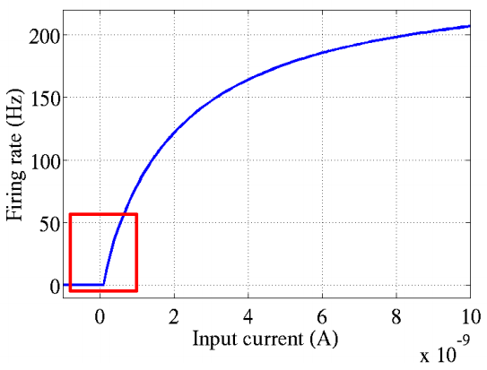
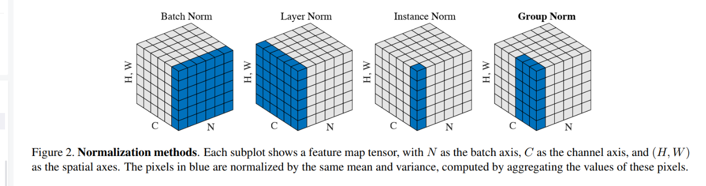
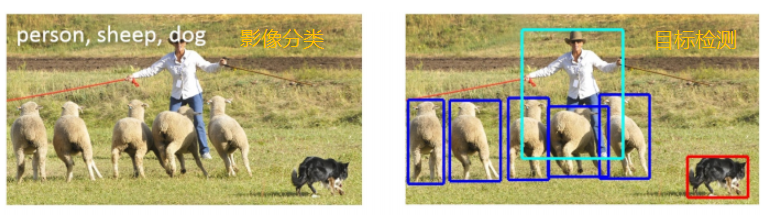
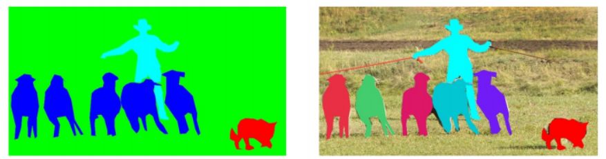
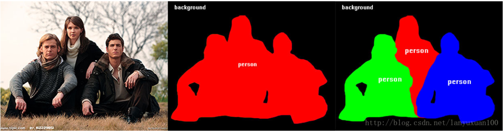
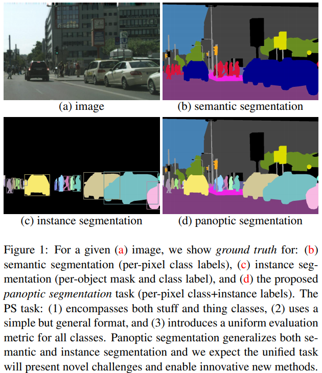
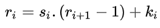

## 激活函数

在人工神经网络中，一个节点的激活函数定义了该节点在给定的输入或输入集合下的输出。标准的计算机芯片电路可以看作是根据输入得到开（1）或关（0）输出的数字电路激活函数。

### ReLU激活函数

在深度神经网络中，通常使用一种叫**修正线性单元(Rectified linear unit，ReLU）**作为神经元的激活函数。ReLU起源于神经科学的研究：2001年，Dayan、Abott从生物学角度模拟出了脑神经元接受信号更精确的激活模型，如下图：

其中横轴是时间(ms)，纵轴是神经元的放电速率(Firing Rate)。生物学家推测和证明了神经元工作具有稀疏性和分布性。（稀疏性指大脑中同时被激活的神经元只有 1% ~ 4%)

ReLU 激活函数的形式：

从上图不难看出，ReLU函数其实是分段线性函数，把所有的负值都变为0，而正值不变，这种操作被成为**单侧抑制**。可别小看这个简单的操作，正因为有了这单侧抑制，才使得神经网络中的神经元也具有了稀疏激活性。尤其体现在深度神经网络模型(如CNN)中，**当模型增加N层之后，理论上ReLU神经元的激活率将降低2的N次方倍**。

与之类似，当训练一个深度分类模型的时候，和目标相关的特征往往也就那么几个，因此通过ReLU实现稀疏后的模型能够更好地挖掘相关特征，拟合训练数据。

那么问题来了：这种稀疏性有何作用？换句话说，我们为什么需要让神经元稀疏？当训练一个深度分类模型的时候，和目标相关的特征往往也就那么几个，因此**通过ReLU实现稀疏后的模型能够更好地挖掘相关特征，拟合训练数据**。

此外，相比于其它激活函数来说，ReLU有以下优势：**对于线性函数而言，ReLU的表达能力更强**，尤其体现在深度网络中；而对于非线性函数而言，ReLU由于非负区间的梯度为常数，因此不存在梯度消失问题(Vanishing Gradient Problem)，使得模型的收敛速度维持在一个稳定状态。这里稍微描述一下什么是**梯度消失问题**：当梯度小于1时，预测值与真实值之间的误差每传播一层会衰减一次，如果在深层模型中使用sigmoid作为激活函数，这种现象尤为明显，将导致模型收敛停滞不前。

参考链接：

[深度学习领域最常用的10个激活函数，一文详解数学原理及优缺点](https://finance.sina.com.cn/tech/2021-02-24/doc-ikftssap8455930.shtml#:~:text=%E6%BF%80%E6%B4%BB%E5%87%BD%E6%95%B0%EF%BC%88Activation%20Function%EF%BC%89%E6%98%AF,%E8%BE%93%E5%85%A5%E9%9B%86%E5%90%88%E4%B8%8B%E7%9A%84%E8%BE%93%E5%87%BA%E3%80%82)

[ReLU激活函数：简单之美](https://blog.csdn.net/cherrylvlei/article/details/53149381)

## 神经网络中的 BN 操作

BN的存在，主要起因于数据分布的问题。所谓数据分布，分为两种情况，一种在输入时数据分布不一样，称之为Covariate Shift，比如训练的数据和测试的数据本身分布就不一样，那么训练后的模型就很难泛化到测试集上。另一种分布不一样是指在输入数据经过网络内部计算后，分布发生了变化，使数据分布变得不稳定，从而导致网络寻找最优解的过程变得缓慢，训练速度会下降，这种称之为内部协方差偏移（Internal Covariate Shift）。

  内部协方差偏移为什么会影响网络训练：训练深度网络时，神经网络隐层参数更新会导致网络输出层输出数据的分布（相对于输入数据分布）发生变化，而且随着层数的增加，根据链式规则，这种偏移现象会逐渐被放大。这对于网络参数学习来说是个问题：因为神经网络本质学习的就是数据分布（representation learning），如果数据分布变化了，神经网络又需要学习新的分布。

  **BN层的作用是对一个batch内的所有样本进行标准化，将不规范的样本分布变换为正态分布。**处理后的样本数据分布于激活函数的敏感区域（梯度值较大的区域），因此在反向传播时能够加快误差的传播，加速网络训练。

假设输入图像大小为$[ N , C , H , W ] $

BN：将一个batch内的样本（$N$ 个样本），按照$N, H, W$三个维度进行标准化，也就是说，在每个通道上将所有的 $N$ 个样本的进行标准化操作。在batch较小时效果不好；

[神经网络中的BN操作（常见正则化处理）](https://blog.csdn.net/qq_37489147/article/details/115705918)

## 语义分割、实例分割

- 目标检测：

- 语义分割（semantic segmentation）：简而言之就是对一张图片上的所有像素点进行分类，即对图像中的每个像素都划分出对应的类别，实现像素级别的分类。（左下即语义分割）

  

- 实例分割(Instance segmentation)：实例分割不但要进行像素级别的分类，还需在具体的类别基础上区别开不同的实例。实例分割（图3右）其实就是目标检测和语义分割的结合。

  -

- 全景分割(Panoramic segmentation)

  全景分割是语义分割和实例分割的结合。跟实例分割不同的是：实例分割只对图像中的object进行检测，并对检测到的object进行分割，而全景分割是对图中的所有物体包括背景都要进行检测和分割。

  

## CNN

### Receptive filed(感受野)

一个输入大小为 11×11的A， 经过一个过滤器大小为 3×3，步长为 1 的卷积核卷积之后，得到一个大为9×9的特征映射。可以看到在 B 中一个 3×3 的区域，在 A 中的感受视野为 5×5。B 经过一个大小为 3×3 ，步长为 1 的卷积核卷积之后，得到一个 7×7 的特征映射。因此在 B 中的一个 1×1 的区域在 A 中的视野就为 3×3。因此，C 中一个 1×1 的区域在 A 的视野就为 5×5。

计算公式为： 

其中  $r_i$ 表示第 i 层输入的一个区域，  $s_i$ 表示第 i 层的步长，  $k_i$表示第 i 层卷积核的大小（filter size）。此计算不需要考虑 padding size。

[CNN：接受视野（Receptive Field）](https://zhuanlan.zhihu.com/p/41955458)

### padding size：

前面可以发现，输入图像与卷积核进行卷积后的结果中损失了部分值（为什么？），输入图像的边缘被“修剪”掉了（边缘处只检测了部分像素点，丢失了图片边界处的众多信息）。这是因为边缘上的像素永远不会位于卷积核中心，而卷积核也没法扩展到边缘区域以外。

这个结果我们是不能接受的，有时我们还希望输入和输出的大小应该保持一致。为解决这个问题，可以在进行卷积操作前，对原矩阵进行边界填充（Padding），也就是在矩阵的边界上填充一些值，以增加矩阵的大小，通常都用“”来进行填充的。

[CNN基础知识——卷积（Convolution）、填充（Padding）、步长(Stride)](https://zhuanlan.zhihu.com/p/77471866)

## 待补充

叉积、点积、余弦相似性、马氏距离

Non-maximum suppression（ 非极大值抑制）

随机森林、k折交叉验证

预训练模型：预训练模型就是一些人用某个较大的数据集训练好的模型

backbone：作用是对一个图像提取特征，后面的分类是自己设计的网络操作。

梯度消失、梯度爆炸

IoU 阈值：

